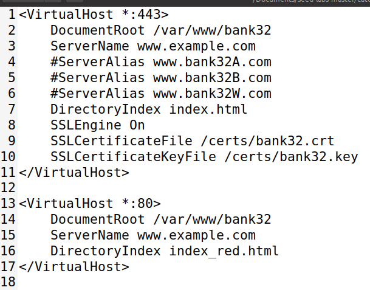

# TRABALHO REALIZADO NA SEMANA #11

## 3: Lab Tasks

### Task 1: Becoming a Certificate Authority (CA)

>Before starting, we had to have the config file in the folder we wanted. To that we used the command:
>
>>cp /usr/lib/ssl/openssl.cnf myCA_openssl.cnf
>
>In this task we had to create a Certificate Authority (CA), which is a trusted authority that creates and signs digital certificates.
>
>By being a CA we can atest that someone (or website) is the owner of a said public key.
>
>To create a cerficate of our CA we had to use the following command:
>
>>openssl req -x509 -newkey rsa:4096 -sha256 -days 3650 -keyout ca.key -out ca.crt -subj "/CN=www.modelCA.com/O=Model CA LTD./C=US" -passout pass:dees
>
>the file "ca.key" contains the private key of the CA while "ca.ct" has the public key.
>
>This is the content of the "ca.crt":
>
>>
>>
>
>>**What part of the certificate indicates this is a CA’s certificate?**
>>
>>In the section "basic constraints" there is an attribute "certificate aithority" is set to "Yes". This shows that it is the certificate for the CA.
>
>>**What part of the certificate indicates this is a self-signed certificate?**
>>
>>This is a self-signed certificate because in the file we can see that the subject and the issuer are the same. On top of that in the command we ran was include the flag "-x509" (used to create self-signed certificates).
>>
>
>>**In the RSA algorithm, we have a public exponent e, a private exponent d, a modulus n, and two secret numbers p and q, such that n = pq. Please identify the values for these elements in your certificate and key files.**
>>
>>

### Task 2: Generating a Certificate Request for Your Web Server

>On this task, the objective was to create a "Certificate Signing Request", CSR. This will be generate by the CA that we created in the task 1.
>
>To do that, we used the following command:
>
>>openssl req -newkey rsa:2048 -sha256 -keyout server.key -out server.csr -subj "/CN=www.bank32.com/O=Bank32 Inc./C=US" -passout pass:dees
>>
>After that, is sugested to do some alterations to the last command, so the certificate allows alternative names to the website.
>
>>openssl req -newkey rsa:2048 -sha256 -keyout server.key -out server.csr -subj "/CN=www.bank32.com/O=Bank32 Inc./C=US" -passout pass:dees -addext "subjectAltName = DNS:www.bank32.com, DNS:www.bank32A.com, DNS:www.bank32B.com"
>
>We an see this information by using the following commands:
>
>>openssl req -in server.csr -text -noout
>
>>penssl rsa -in server.key -text -noout
>
>With the correct server name ofcourse and obtain the following results:
>
>>
>
>And..
>
>>
>
>>

### Task 3: Generating a Certificate for your server

>As instructed we used the following command:
>
>>openssl ca -config myCA_openssl.cnf -policy policy_anything -md sha256 -days 3650 -in server.csr -out server.crt -batch -cert ca.crt -keyfile ca.key
>
>This command allows us to convert the "server.csr" in a self-signed certificate, "server.crt".
>
>>
>
>>

### Task 4:  Deploying Certificate in an Apache-Based HTTPS Website

>
>For this task we had to deploy a webiste with a certificate (meaning it will have a https connection).
>
>To accomplish this we wil be using an Apache server.
>
>First, we edit the appache config file (bank32 apache ssl.conf), to the following configuration:
>
>><VirtualHost *:443>\
>>DocumentRoot /var/www/bank32\
>>ServerName www.bank32.com\
>>ServerAlias www.bank32A.com\
>>ServerAlias www.bank32B.com\
>>DirectoryIndex index.html\
>>SSLEngine On\
>>SSLCertificateFile &#47;certs&#47;bank32.crt ➀\
>>SSLCertificateKeyFile &#47;certs&#47;bank32.key ➁\
>><&#47;VirtualHost>
>>
>>
>><VirtualHost *:80>\
>>    DocumentRoot /var/www/bank32\
>>    ServerName www.example.com\
>>    DirectoryIndex index_red.html\
>><&#47;VirtualHost>
>
>After that we need to enable apache's ssl module and enable the site. We ran the commands:
>
>>a2enmod ssl
>>
>>a2ensite bank32_apache_ssl
>
>This resulted in:
>
>
>
>After Apache had been configured we could start the server. For that we used the command "service apache2 start".
>
>
>
>We can already access the website however we get a warning:
>
>
>
>This means that while our certificate is being recognized it is from an unknown (or untrusted) CA. 
>
>We can add our CA in the list of truted CAs within Firefox. To do this we need to add the file "ca.crt" to preferences -> Pravate & Security -> View Certificate.
>
>
>
>This makes it consider it secure, but even after it gives a statement about it:
>
>
>
>This is essentially because of what makes a certificate a good way to verify a website: that there is not a large group of authorities. Because there is only a selected group of CA it is possible to verify its authenticity and know who to trust. 
>
>Therefore because our source is "weird" to Firefox even after we said we trusted it still acts in a cautiously way.
>
>This is how the website looks after all the steps we have done, it is possible to notice that the lock on the left of the url doesn't show anything weird (although if we click it it show the meesage we talked before):
>
>

### Task 5: Launching a Man-In-The-Middle Attack

>In this task we will try to impersonate a website. For this we will be trying to try and create a fake "www.example.com".
>
>The first step is to setup the site like we did for www.bank32.com
>
>We will change the config file, which will now look like this:
>
>
>
>We also have to change the hosts folder (to be able to modfy this file we will use gedit admin:///etc/hosts):
>
>
>
>After that we can rebuild docker with "dockbuild" and start apache once again.
>
>Now that the server is running, when we try to acces it gives a different warnging:
>
>
>
>The reason for this is because we are trying to use the certificate we generate for "www.bank32.com" with "www.example.com". Firefox can recognize that something is not right and gives us this warning.
>
>This shows that a MITM attack was not successful because the browser could pick it up.

### Task 6: Launching a Man-In-The-Middle Attack with a Compromised CA

>For this task we had to assume that our CA was compromised by an attacker. Therefore, the attacker can generate its own certificates for the fake website.
>
>So, first, we generate the certificate for oue scan website (www.example.com). To do this we only need to run the command from task 2 but changing it now from "www.bank32.com" to "www.example.com" and etc.\
>Here is what we did:
>
>
>
>After this is needed to sign our certificate with our CA. Once again, we only had to perform the same steps as we did before:
>
>
>
>After doing this, we had to change our apache config file to reflect the new change:
>
>
>
>We also had to load it onto the server by adding it to the "Dockerfile":
>
>
>
>Afterwards we could rebuild the docker container and start the apache service.
>
>When trying to load our site we can see this:
>
>
>
>
>
>Firefox still shows us a message but we get no warnings this time.
>
>This is because the certificate is valid and signed by the CA, also the CN match. 
>
>Firefox could also detect that "www.example.com" had another certificate (from the original website and not our bootleg one), however websites having more than one certificate is not a problem.\
>For example, website may have more than one certificate when one of them is close to expire (to not generate down time).
>
>To finish, from this we conclude that if root CA's keys is compromised, then an attacker can create a certificate for themselves and impersonate a website.
>
