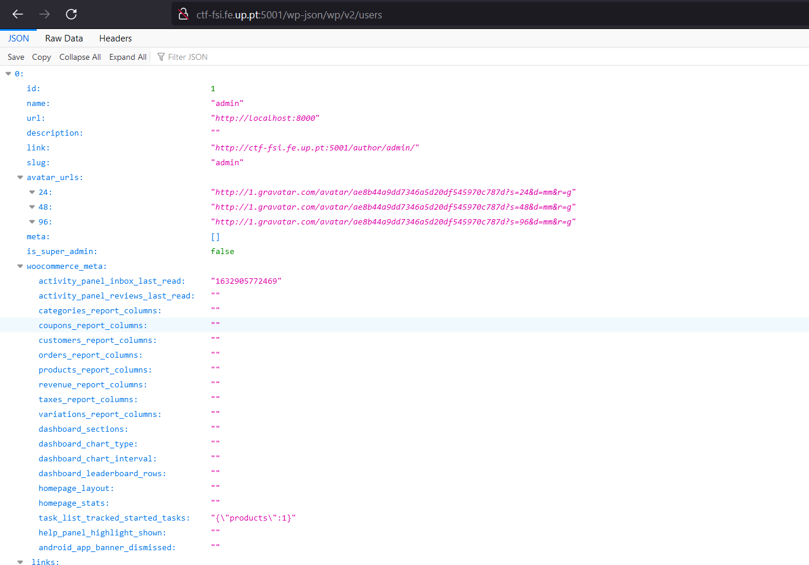
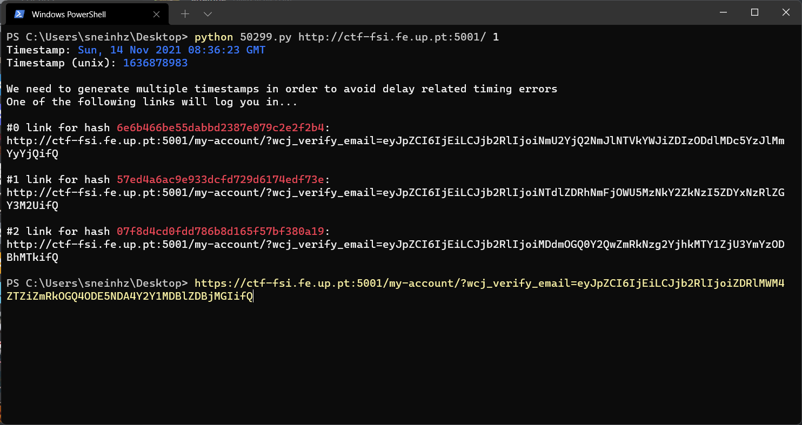
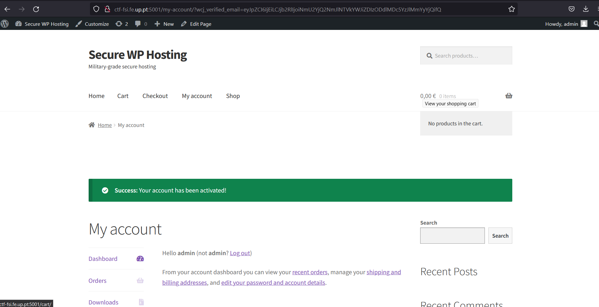
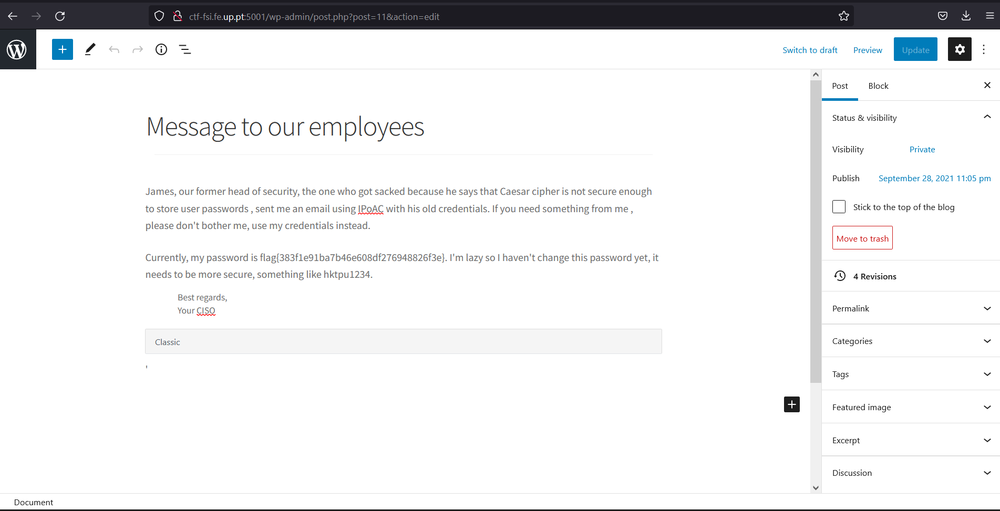

# TRABALHO REALIZADO NA SEMANA #4

### Task 1: Manipulating Environment Variables

- O printenv lista todos os ambientes de variáveis do sistema, para procurar um ambiente especifico, podemos fazer, por exemplo, escrever o comando printenv "PWD"  e irá imprimir apenas /home/seed

### Task 2: Passing Environment Variables from Parent Process to Child Process

- Foi observado que quando fork() é realizado num programa, o processo 'filho' possui o mesmo ambiente de trabalho do processo 'pai', logo quando realizamos printenv vemos que não há diferença entre os dois ambientes.
- Um processo filho usa o mesmo pc (program counter) e também os mesmos registos do CPU.

### Task 3: Environment Variables and execve()

- Quando usamos o array de pointers "environ", o mesmo irá ser usado como ambiente do programa e substituir o processo atual.
- Por outro lado, quando passamos a variável "NULL", é como se estivéssemos a passar apenas o último apontador no array, significando que não estamos a usar "environment variables".

### Task 4: Environment Variables and system()

- A chamada do system() cria "automaticamente" um processo filho que permite executar o comando da shell e finalizar o programa atual. Enquanto que a chamada do execve() substitui  o processo atual pela execução do comando pedido, para ter um efeito semelhante ao system teríamos que usar o fork(). 

### Task 5: Environment Variable and Set-UID Programs

- Set-UID (set user ID on execution) é um tipo especial de permissão no Unix e Unix-like OS (como linux). Permite correr certos programas com privilégios escalonados.
- A shell possui implementações contra permitir acesso a variaveis sensiveis quando a correr com privilégios escalonados (isto é a correr com autorizações de outro user).

### Task 6: The PATH Environment Variable and Set-UID Programs

- Executou-se o programa da 'Task 6'  (do código pedido para ser compilado), com setUID (privilégios escalonados), e executamos o comando 'ls' através de um system(), que no momento de excução possuia privilégios root. No momento, o 'temporary environment variable' apontava para a ls referente ao programa zsh (quando fizemos: sudo ln -sf /bin/zsh /bin/sh). Como o zsh foi executado com priviégios root, conseguimos ter uma shell com privilégios escalonados. (e fazer bypass da proteção do /bin/sh e /bin/bash que alterava a shell para o id real (remover privilégios) ).

# CTF

Reconhecimento:

**_Desafio 1_**

O primeiro passo foi aceder a página do servidor wordpress e fazer a análise da programação do site (com as ferramentas para developers do web browser). Ápos isso, no html da página, procuramos por informações que pudessem ajudar na identificação de uma vulnerabilidade.
As informações coletadas foram: 

- Versão do wordpress 5.8.2;
- Plugin instalado woocommerce 5.7.1;
- Tema do storefront (... gutenber-blocks.css versão 3.9,1);
- entre outras;

Uma coisa que ajudou, foi procurar por wp-content e wp-content/plugins na área de pesquisa do documento html (uma vez que já sabiamos que era um servidor wordpress).

As possíveis contas de usuários também foram verificadas utilizando o link: http://ctf-fsi.fe.up.pt:5001/wp-json/wp/v2/users/1.
Onde indicava que o admin possui o nome "admin" e o id associado a conta é 1 (o que nos ajudou mais tarde).

Com essas informações, procuramos em diferentes sites sobre CVEs associados às mesma e, com algum trabalho, encontramos o CVE-2021-34646, que funcionava com as informações que tinhamos. Com isto, obtivemos a flag do desafio 1.

**_Desafio 2_**

Procuramos por um exploit já feito para o CVE-2021-34646, encontramos no site "https://www.exploit-db.com/exploits/50299"; a utilização do mesmo foi simples e funcional.

Para corrermos o exploit, utilizamos o comando: python 50299.py website_pretendido id_da_conta, como mencionado no própio exploit. 
No nosso caso foi: python 50299.py http://ctf-fsi.fe.up.pt:5001/ 1 .

- Id 1, pois representava o admin (segundo o que verficamos). O exploit deu-nos alguns links em que um deles redirecionava para a página do admin já autenticada.

Com isso, chegamos a página onde se encontrava a flag do desafio 2.

