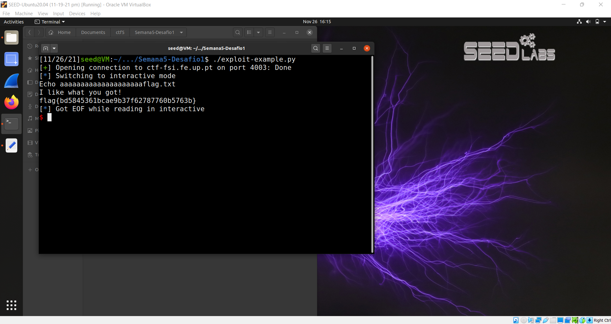

# TRABALHO REALIZADO NA SEMANA #5

### Task 1: Getting Familiar with Shellcode

- When running the code, we can get to the root shell with both the 32bit and 64bit (the a32.out and a64.out files). This is because our system is 64bit, but it also has compatibility with 32bit commands.
- What the code does is copy the shellcode (string of the code that calls the shell) to the stack (in char code[500]).
- Then we forced the code to be an int and were able to call the codeshell using func(). So, with this we are able to have access to root shell.

### Task 2: Understanding the Vulnerable Program

- This task was a preparation for task 3. We first had to turn off some protections linux has by default. Then we had to give ownership to stack.c to root and give the current user of calling the program with root permissions.
- For task 3 we needed stack-L1, so we checked that it had a buffer of size 517.

### Task 3: Launching Attack on 32-bit Program (Level 1)

- First, we created a dummy badfile to gather information about stack-L1. Then we opened the debug file for stack-L1 (stack-L1-dbg) file in gdb to gather the information we needed. (See image below)

- Then we ran the commands to gather info (things like "b bof", "run", etc). From that we got the ebp (which in our case was 0xFFFFCA18) and the address of the start of the buffer (0xFFFFC9AC). (See images below)

- With the information collected we are now able create the actual badfile with the help of exploit.py, however first we need to change some information in it.

- The information we changed and how we got/calculated them is:
- 1) start: We changed this information to "490", the reason for this number is because the buffer has a size of 517 and our shellcode has a size of 27bytes, and we decided to put our shellcode at the end of the buffer, and 517-27=490. 
-  (in this case, since we can point exactly to our shellcode, it is not necessary but if we put the shellcode at the end in normal condition, we are able to "miss" the pointer but have our code have 0s with means jump to the next instruction. Eventually we get to our shellcode).

- 2) ret: This is the return in which we want to change to point to our shellcode. We know that the buffer starts at 0xFFFFC9AC and that its size is 517. We put our shellcode 27bytes before the end so at 0xFFFFC9AC + 490 (in decimal). This gave our return address which was 0xFFFFCB96.

- 3) offset: This is where we need to inject our return address that points to our shellcode. We now that return we want to change is after the ebp, we also know that the ebp has a size of 4 bytes. If we 0xFFFFCA18 (ebp address) - 0xFFFFC9AC (buffer address) we get that the ebp starts at 108 bytes after the buffer. Then we add the size of the ebd (the 4 bytes) and we get 112, which is the place of the return we want to modify.

Running the exploit:

- We open the terminal where exploit.py and stack-L1 is located. We run exploit.py creating the badfile we need to use the exploit. Then we run stack-L1 and get access to rootshell. (See image below) 

# CTF

### Desafio 1

- Since the main.c code was provided we start by examining it and trying to find a way to exploit it.
- We were able to see that our BUFFER had a size of bytes, however scanf was reading 28 bytes.

- We can overwrite meme_file because conveniently it has 8 bytes and it is located in the right placed. (See image below)

- Editing and running the provided exploit-example.py to write 28 bytes, the last 8 ones being "flag.txt" (what we wanted meme_file to be).

- With that we are able to successfully access the contents of flag.txt.

- Since we tested using in debug mode, we will try to launch the exploit without it. Calling the exploit-example.py to ctf-fsi.fe.up.pt 4003 we are able to find the flag for challenge 1. (see images below)

### Desafio 2

- Once again we start by analyzing the provided main.c .
- The difference from the first challenge is that now we have the BUFFER, val and meme_file. A new condition is that val should be 0xFEFC2122.

- We edited our exploit-example.py to access ctf-fsi.fe.up.pt 4000 (for the second challenge) and the string to send over, adding the number we need to send before "flag.txt". (see image below)

- Performing the exploit is successful:

- As shown in the image above when sending over the appropriate string we are able to bypass the added security and read "flag.txt" getting the flag we needed for the second challenge.

