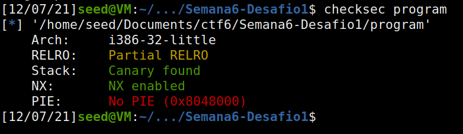

# TRABALHO REALIZADO NA SEMANA #6

- First, we run the server and test if it is working. After the server loads, we can do:

- echo hello | nc 10.9.0.5 9090 (after we also must press ctrl+c to finish the task in this case) -> if the server is up and running, we will receive a returned properly.

### Task 1: Crashing the program

>- For task 1 we will have to exploit the printf() and the format string. In our string we will add “%n” such as when the function prinft() is run and tries to print the string it will overwrite the return address to exit the function, meaning our program is now stuck (essentially crashing the program). Also, what has crashed is the program format.c not the server itself.
>
>- An explanation for this is that “%n” in a strings loads the variable where the pointer in located and change the value of the variable to the number of characters printed by printf() so far (before the occurrence of “%n”).
>
>

### Task 2: Printing out the Server Program's Memory

>>A. The goal for task 2.a is to read the first 4 bytes of our string (the one we send to the server). For this we change our string to have the 4 bytes we want to read in the beginning (in our case we chose 0xAABBCCDD). After that, we write “%x” as many times as needed until we reach the beginning of our string, in which the content of our string is read by the printf().
>>
>>- In our case the amount of “%x” needed was 64. This number can be obtained by trial and error, however a better way to find it is to use gdb and its position and where we are in the stack.
>>
>>
>
>>B.	For task 2.b we needed to read the secret message stored in the heap area.
>>
>>- The server already gives us the address for the message, as such we can utilize of our own string and what we did in task 2.a to perform task 2.b.
>>
>>- First, we write the address of the secret message in the beginning of our string (in this case 0x080b4008).
>>
>>- Second, we know that to access the begging of our string we must use “%x” 64 times, however since this time we want to read the content of the address and not the address itself, we will do “%x” 63 times and “%s” on the 64th time, since “%s” interprets the number as an address and reads what it is in there.
>>
>>
>>
>>- The secret message was: “A secret message”.
>>
>

### Task 3: Modifying the Server Program's Memory

>>A. For this first task we needed to change the secret variable into something else.
>>- Like we have done for task 2.b we can access the address by making it the beginning of our string into it (in this case the address is 0x080e5068).
>>
>>- We know we can access it by using “%x” 64 times. To change its values from 0x11223344 to something else we can do “%x” 63 times plus “%n”. The explanation for it is the same we used to crash the server, we can write to the address the pointer is pointing to, in this case it was pointing to where the secret variable was located.
>>
>>
>
>>B. This is a more elaborated task for the 3.a, not only we have to change the value of the secret variable, but we must change it to a specific value: 0x5000.
>>
>>- We know that “%n” print the number of characters printed in the string so far, so to be able to make it write 0x5000, we must make it so that our string has 5000 characters before it
>>- After that it is a simple as task 3.a:
>>
>>
>>
>

- From this exercise we were able to understand how printf() is used to access or change memory from an attacked device, how it can be exploit and what cautions we need to have when using it.

- Also, what effects “%x”, “%s”, “%n” (etc.) have in a string and how we can use it to our advantage when performing an attack.

# CTF

### Challenge 1

>The first thing we did was identify the security properties using checksec:
>
>
>
>From that we can see that although we have protection the is no PIE (which provides some address randomness to the main executable). With that we know that we may be able to perform a string format if we have a scanf in the program.
>
>Luckily analyzing the code we can see that there is one:
>
>
>
>Since there is a scanf we can pass to it our string. We also can see that there is a function that opens the flag.txt for us, so if we are able to run it we can read its content and get that flag.
>
>We can execute the program with gdb and use "p load_flag" to see where the file is, and since PIE is off we know that the address won't change the next time we run it.
>
>
>
>We already know the address of the function, so now we just need to read it. Since we can pass our string we can write load_flag()'s address and the use '%s' to read it. So, we change exploit_example.py to reflect this:
>
>
>
>Now that we have our exploit_example.py ready, we just execute it (and get the flag for the first challenge):
>
>
>

### Challenge 2

>The second challenge is a hardened version of the same task. When we run checksec we can see that there is the same restrictions from the first challenge.
>
>Looking at the code provided we can see that this time we don't have a function that already opens our code, however if we are able to set key = 0xBEEF we can run BASH we open it ourselves.
>
>
>
>Like last time, we run program with gdb to find where the variable is located, since we don't want the value of key but its address we do "p &key".
>
>
>
>We know where key is located. We can use scanf to our advantage (once again), we can put the address where key is located to in our string and pass it 0xBEEF using '%n". But there is a little problem: 
>
>>'%n' writes the number of characters we have written so far in our string. 
>>
>>To solve this we can use '%.Ax" (where A is the amount of characters we want to read a var) and set it so the size we want.
>>
>>Since, '%x' read from an address we have to keep that in mind. So, we can format our string to be like:
>>
>>address for %x + address for %n + '%.Ax' + '%n'
>>
>>We just have to remember that writing the addresses takes some chars in size, so we have so subtract it from 0xBEEF.
>
>Calculating A:
>
>>Now that we know how to write our string we have to calculate 'A':
>>
>> 0xBEEF = 48879
>>
>> We know that we have written 8 chars so far for our address, that left us with 48879 - 8 = 48871.
>>
>> This is the number we got to substitute 'A' for.
>
>Going to exploit_example.py we change to now send the string we have prepared:
>
>
>
>OBS: Let's also change the port for the remote connection.
>
>When we run our exploit it is successful, and we get access to BASH, to open flag.txt and read it we simply do "cat flag.txt":
>
>
>
>And here is a close up:
>
>
>
With challenge 1 and 2 solved we have solved the ctf.
