# TRABALHO REALIZADO NA SEMANA #8

## 2: Lab Environment

>The first thing to do was assigning the URL "www.seed-server.com" to the ip 10.9.0.5 in /etc/hosts/ file.
>
>To acomplish this we can use the command: gedit admin:///etc/hosts
>
>>#### 2.1: Container Setup and Commands
>>
>>This step was to build and run the server which contained the website with the SQL data base. For that we run 'dcbuild' then 'dcup'.
>>
>>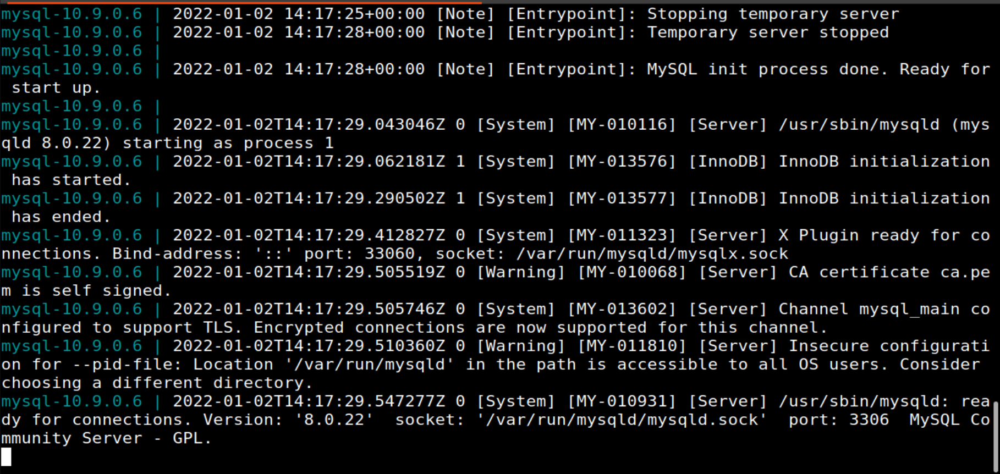
>>
>>Right after that our task was to run commands in the shell for the data base. We needed to find the container where it was running (which can be done with 'dockps').
>>
>>After that we can use 'docksh <id> (which in our case was 2a...).
>>
>>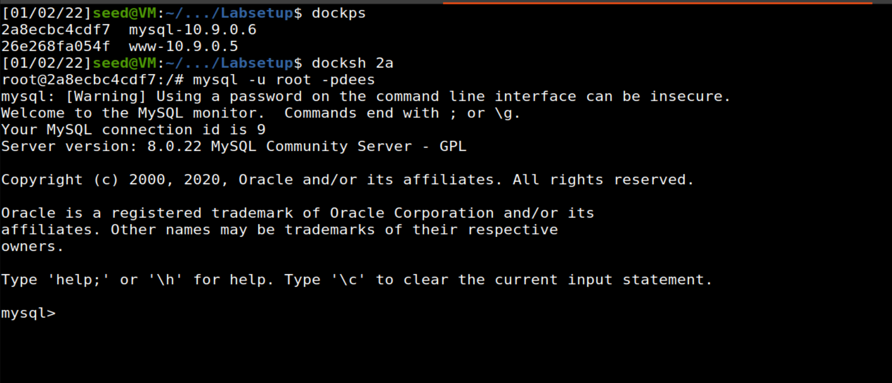

### Task 1: Get Familiar with SQL Statements

>The first task was about getting familiar with SQL. So we needed to do basic tasks on the provided database (sqllab users).
>
>First we needed to get a shell on the mySQL container. Since we are already on the container (since we use docksh) we only needed to do 'mysql -u root -pdees'. After logging in we needed to load the provided database, for that we did 'use sqllab_users' and verified if it was working with 'show tables'.
>
>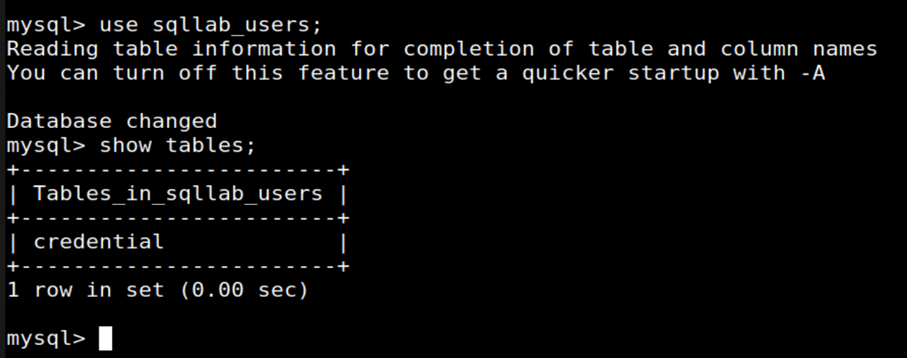
>
>We also used the command 'select * from credential where Name = 'Alice'' to get all the information from Alice.
>
>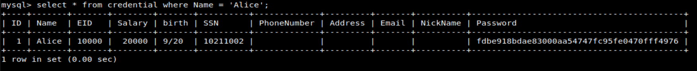

### Task 2:

>This tasks use the login page of the website of the server we are running:
>
>>A. SQL Injection Attack from Webpage
>>
>>The goal for this task is to login to the web application as the administrator so that we can se the information of all employess.
>>
>>We know that the account name is admin but we dont know the password.
>>
>>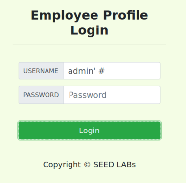
>>
>>We were able to log in by inserting "admin'#" into the username, wihtout needing to insert a password. Here is the result:
>>
>>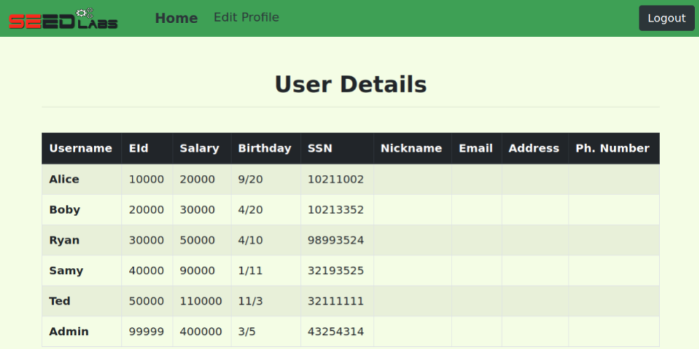
>>
>>What "admin'#" means is usernmame = admin, then we comment the res of the query, thus bypassing whatever it was asking for.
>>
>
>>B. SQL Injection Attack from Command Line
>>
>>This task is to basically repeat the task from the previous one. The change is that this time we needed to use curl (in the command line) instead of the loading the page on a browser.
>>
>>We know that the HTTP method used is GET, and the format is: 'www.seed-server.com/unsafe_home.php?username=alice&Password=11'.
>>
>>Using the command curl and passing the same information as if we were to use the browser we got: curl 'www.seed-server.com/unsafe_home.php?username=admin%27%20--%20&Password='
>>
>>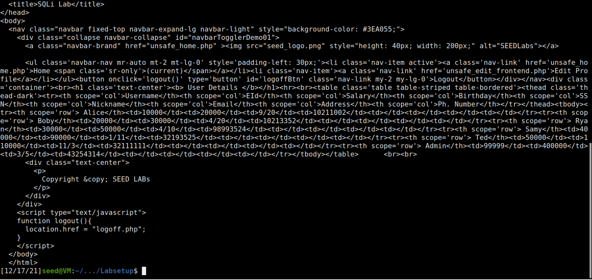
>>
>>By pasting the opening the html it gaves us into a browser we get:
>>
>>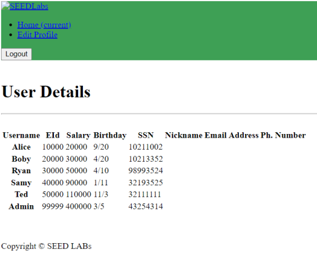
>
>>C. Append a new SQL statement
>>
>> For this task we needed to use the login page on the browser once again, but this time login into Alice's account but also add some more stuff. We can just use the same SQL injection vulnerability we used for task 2A ("Alice'#'). This time however we need to append try to append something to the data base.
>>
>>By trying "Alice'; INSERT INTO credential() VALUES (). We get:
>>
>>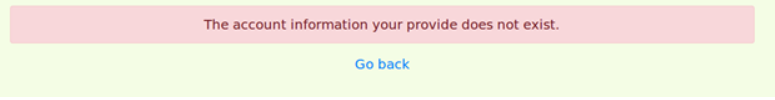
>>
>>We could not successfully insert into the table because the mysql has a default protection against some operations (to prevent some type of attacsk).
>>
>>Searching on the internet we could find that the countermeasure is the PHP's mysql extension (mysql::query() API). The attack did not worked because the API does not allow for multiple queries to run in the database server. Thus trying to prevent SQL injection.
>>
>>That means that we cannot modify the data or insert/delete using the appeding tactic.

### Task 3:

>In this tasks we used the Edit Profile page from the website of the server we were running.
>
>>A. Modify your own salary.
>>
>>In this task, we needed to modify our own salary (us being Alice). To to that, we login as Alice, Alice'#, and on the "Edit Profile" page we needed to use commands to increment the Alice's salary in this case.
>>
>>The edited the Alice's Nickname with the command: alice', salary = '40000. With that we change her nickname to alice and her salary to 40000. We could just do: ', salary = '40000 wherever we wanted.
>>
>>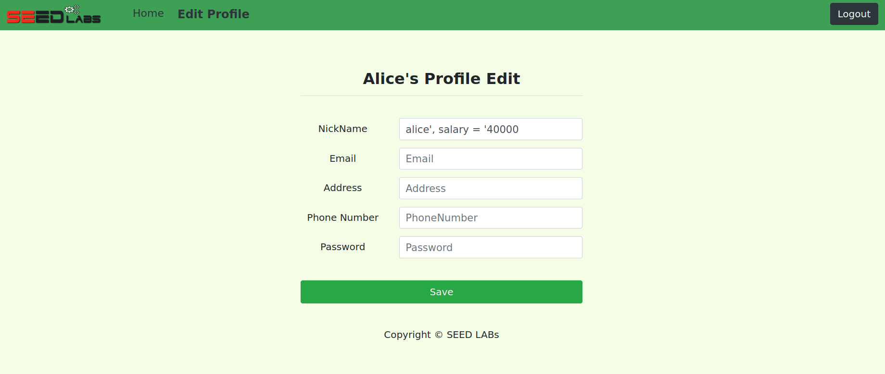
>>
>>And the result that we got:
>>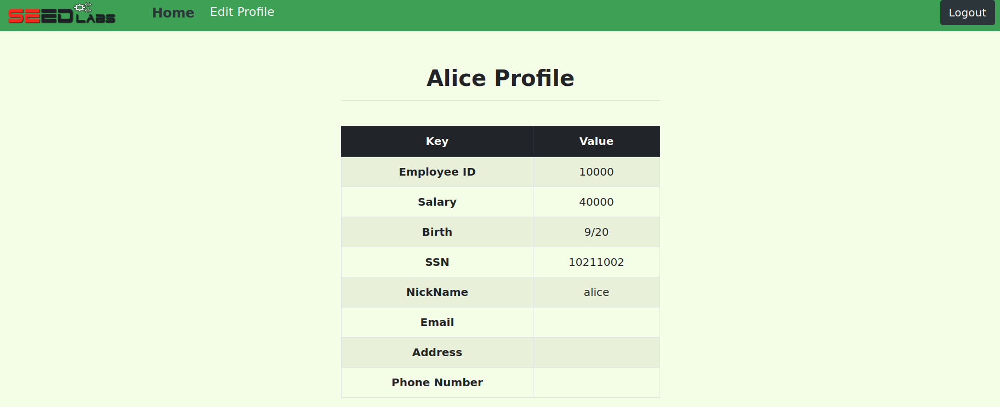
>
>>B. Modify others people' salary.
>>
>>For this last task, we needed to do something similar to the previous task. We needed to change, as Alice, her boss's salary. For that we used the command: ', salary=1 WHERE Name='Boby';# 
>>
>>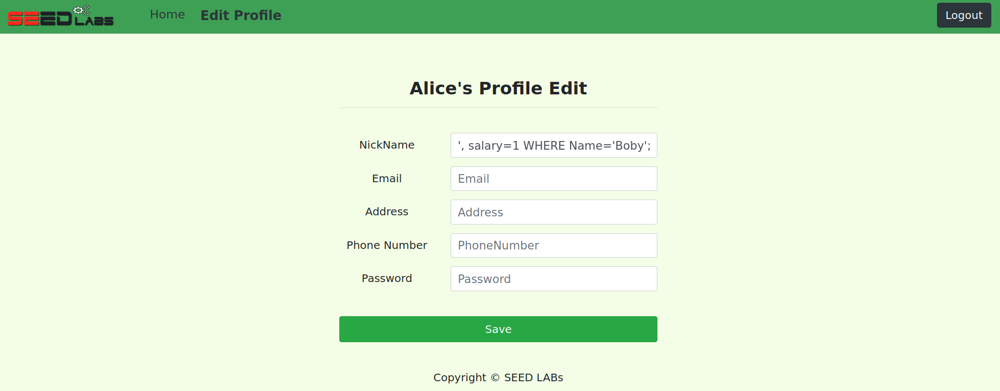
>>
>>And the result that we got:
>>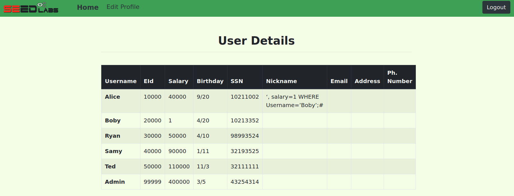

# CTF

### Challenge 1

>The first thing we did was to explorer the code provided and identify how to query to login was made:
>
>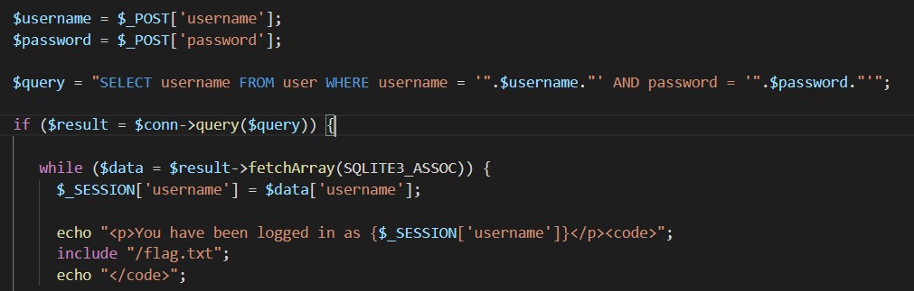
>
>From that we identified that we could just use the same tactic we use to login as admin on task1. By using "admin';#", we also put "#" on the password just in case.
>
>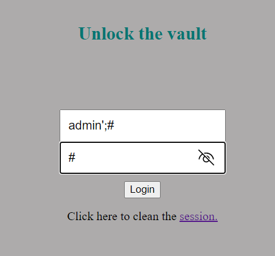
>
>This was sufficient for was to login into the admin account and get the flag:
>
>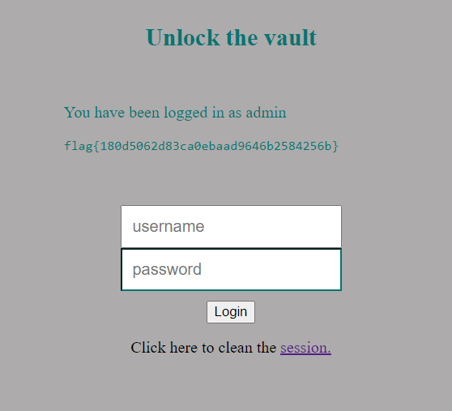
>

### Challenge 2

>One funcionality that we had access to was to do a ping to an host.
>We tried different commands and concluded that a system call linux was being made.
>So with the command ; ls, we got access to the files of that host, because it runs the command ping then it runs the command "ls" and it worked. With that we only needed to do ; cat /flag.txt to get the its content.
>
>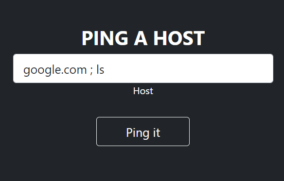
>
>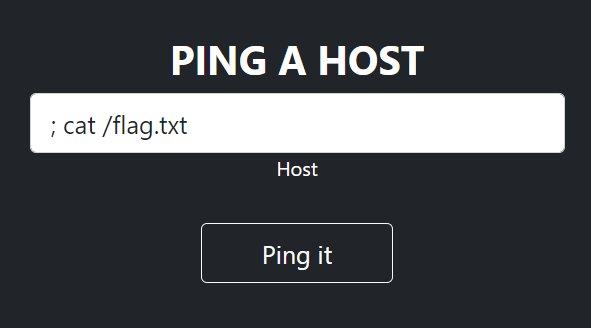
>
>And with this, we got the flag:
>
>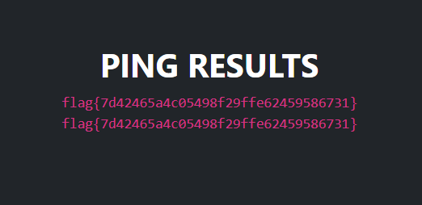
>
